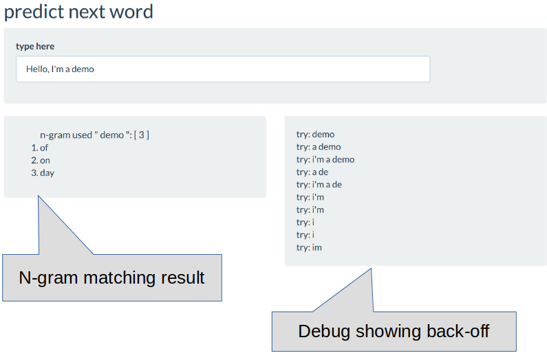

N-gram word prediction
========================================================
author: Yinshu Zhang
date: Nov. 25th 2019
autosize: true
git repo: <https://github.com/yszhangit/final>

Why predict next word
========================================================
- input prediction help to enhance user experience

Suggestion next word base on text mining results.
- use case: search engine, mobile apps

Similar to old auto-complete is based on list of all available choices, modern day of prediction is base on probability of given conditions. For the next word prediction application, the condition is words user has inputted, a prediction model should suggest next word with high probability based on common phases.

  

n-Gram
========================================================
In text mining analyses, lot of time we are interested in relationships between words, in particular, which words tend to follow other words immediately. 

- By definition, n-gram is "a contiguous sequence of n items from a given sample of text or speech" - wikipedia

"n" in n-gram refers to number of words, a single word is called uni-gram, two words called bi-gram and so on. For example, "A quick fox" is a tri-gram token, "A quick fox jumped" is a 4-gram token.

- n-gram model

n-gram model is when given a sequence of words, what is the likelihood of next word. n-gram model benefit its simplicity and scalability.

Zero-frequency problem and back-ff
========================================================
n-gram model is assume non-zero frequency of given condition, but in practise, there will be conditions result zero probability. For example out of vocabulary word, or infrequent words that are not covered in training set. 

To solve this problem, the simple smoothing technique is to reduce the n-1 condition. For example, if a 4-gram "brown fox jumps over" does not yield next word, just assume, then we will use 3-gram "fox jumps over", if still no result in data set, reduce to "jumps over" until "over". With each step backed off, the probabilities of non-frequency is creased.

Prove of concept 
========================================================
The demo you will see is a simple n-gram models created with 2M articles from news, blogs, and tweets, due to the limitation of publish site, we can only create a small data set for demonstration. 

A model is created with 2-gram to 6-grams from 10% of input, and filter in-frequent n-grams. When user input pause, a server process will clean up the text, try to find n-gram with all words except last one, if n-gram are found, output will be displayed in order to highest probability on top. If n-gram runs into zero-frequency problem, server function will recursively called with removing first word, until n-gram became 2-gram, which searched by only one word.

Usage of Demo
========================================================
This is a prove of concept demo <https://yszhangit.shinyapps.io/final/>

